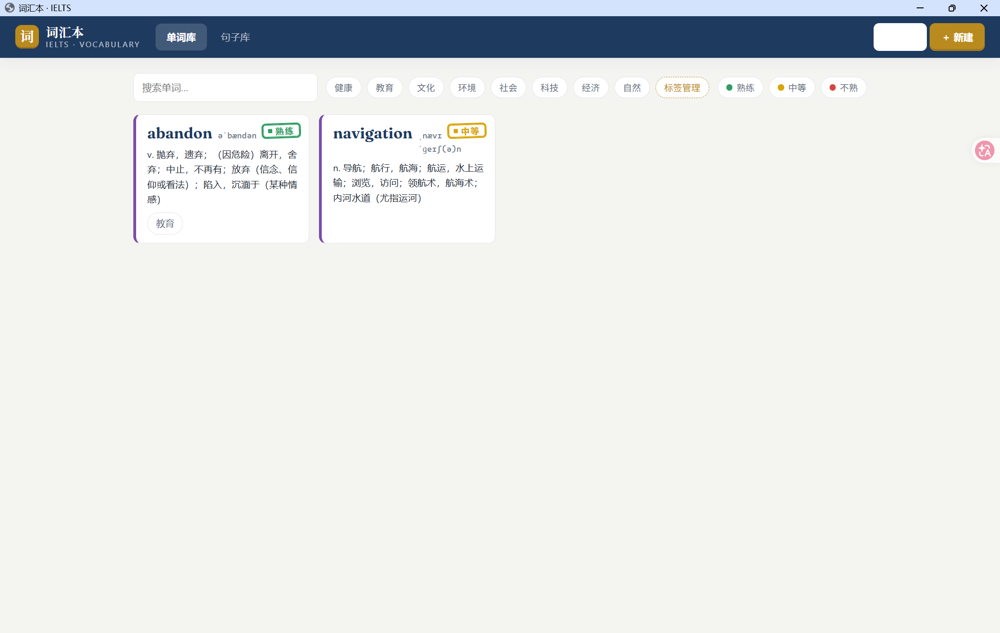
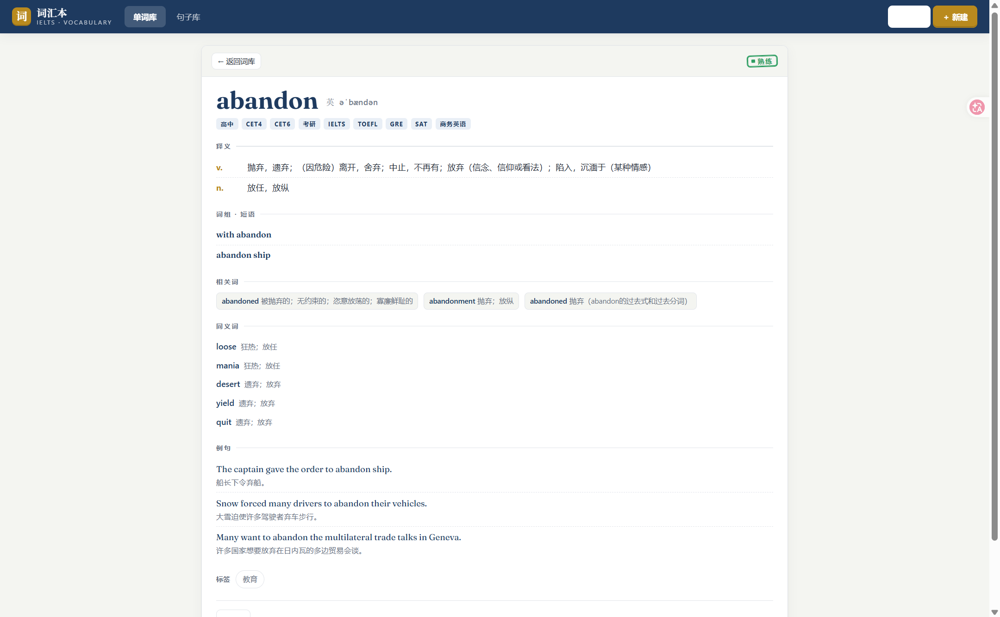
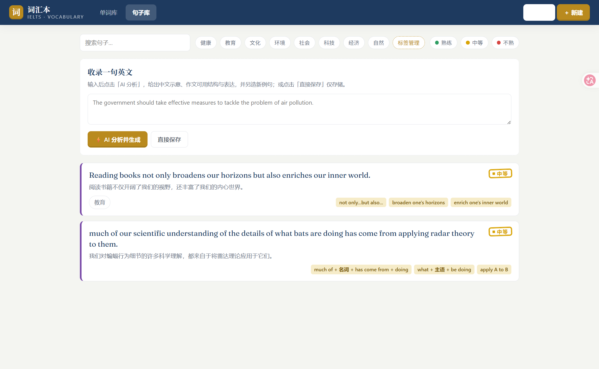
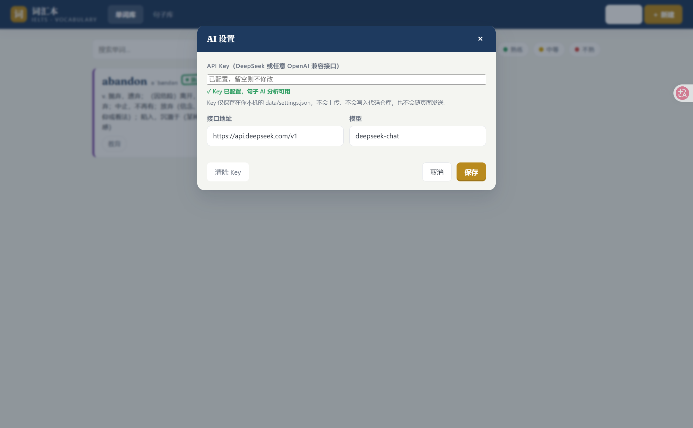

# 词汇本 · IELTS Vocabulary Note

一个**完全本地运行**的雅思词汇与例句学习笔记工具。单词自动从有道词典获取释义/词组/例句，句子可选由 AI（DeepSeek / 任意 OpenAI 兼容接口）分析出作文可用结构与表达。

所有数据（单词、句子、标签、熟练度、你的 API Key）都保存在**你本机的文件里**，不上传任何服务器，打开代码仓库也看不到你的数据。

> **先说明一点**：这是「代码开源 + 数据本地」的形态。
> 开源的是**源码**——别人 clone 后在自己电脑上跑出一模一样的网站，各自的数据互相独立、不出本机。
> 运行中的 `http://localhost:3500` **只在你自己的电脑上可访问**，其它设备/其他人无法通过这个地址连到你的电脑，也不会看到你的数据。

## 功能

- **单词库**：新建单词自动从有道词典填充中文释义、音标、词组、相关词、同义词、双语例句（可再手动修改）；有道式详情页；编辑、删除。
- **标签分类**：预设科技/自然/教育/社会等类别标签，可新建、重命名、删除；按标签与熟练度筛选。
- **熟练度**：熟练 / 中等 / 不熟，绿 / 黄 / 红三色印章标注。
- **句子库**：输入英文例句 →（可选）AI 返回中文示意 + 作文可用结构 + 固定搭配 + 另造 1~2 个新例句；不填 AI Key 也能**直接保存**句子，仅做本地笔记。

## 运行

### 环境要求

- **Node.js ≥ 22.13**（本项目零第三方依赖，仅用 Node 内置 `node:sqlite`）
- 检查：终端运行 `node -v`，能显示版本号即可。

### 方式一：Windows 双击 `start.bat`（最简单）

1. 进入项目文件夹，双击 `start.bat`。
2. 会**自动**完成两件事：
   - 后台最小化启动一个服务窗口（任务栏可见，名为 `IELTS-Vocab-Service`）
   - 弹出独立的浏览器应用窗口（爱听写式，无地址栏）
3. 用完关闭：点任务栏那个 `IELTS-Vocab-Service` 窗口，关闭它即可停止服务（浏览器窗口可随手关掉）。

### 方式二：命令行启动（macOS / Linux / Windows 通用）

```bash
# 在项目根目录下
npm start
# 或（两者等价）
node server.js
```

看到 `IELTS 词汇本 running at http://localhost:3500` 即启动成功，浏览器打开 <http://localhost:3500>。

停止服务：回到终端按 `Ctrl + C`。

### 首次使用建议

1. 打开页面后，点右上角 **⚙ 设置**，填入 AI Key（可选，见下节）。
2. 到 **单词库** 点「＋ 新建」，输入单词（如 `abandon`），点「查词并填充」→ 自动填好释义/词组/例句 → 选个标签和熟练度 → 保存。
3. 到 **句子库**，贴一句英文例句，点「⚡ AI 分析并生成」或「直接保存」。

### 常见问题

| 问题 | 解决 |
|---|---|
| 双击 `start.bat` 后浏览器没弹出 | 服务可能没启动成功，看看任务栏是否有 `IELTS-Vocab-Service` 窗口，里面有报错信息（例如端口被占用） |
| 提示端口 3500 被占用 | 可能有旧的 `node server.js` 还在跑：任务管理器结束所有 `node.exe`，再重新启动 |
| 网页打不开 / 白屏 | 确认服务窗口还在、`http://localhost:3500` 能访问；硬刷新 `Ctrl + F5` |
| 之前的数据在不在 | 数据都在项目里 `data/` 文件夹，删了 `data/` 才会清空 |

## 配置 AI（可选）

点右上角 **⚙ 设置**，填入：

| 字段 | 说明 | 默认 |
|---|---|---|
| API Key | DeepSeek 或任意 OpenAI 兼容接口的 key | 留空 = 不启用 AI，仅存储 |
| 接口地址 | OpenAI 兼容 base URL | `https://api.deepseek.com/v1` |
| 模型 | 模型名 | `deepseek-chat` |

- 填好点「保存」即可。Key **只保存在你本机**，设置界面只显示"已配置/未配置"，不回传明文。
- 不填 Key：句子区只有「直接保存」可用，仅做本地笔记；填了 Key 才有「AI 分析」。
- 想换 Key：重新打开设置，输入新 Key 保存；或点「清除 Key」。

> 兼容旧版：若项目根目录存在 `key.txt`，也会作为 Key 读取。

## 数据与隐私

- 单词 / 句子 / 标签存在本地 SQLite：`data/vocab.db`
- API Key 存在本地：`data/settings.json`
- 以上均在 `.gitignore` 中，**不会提交进仓库**；Key 明文也不会回传给前端页面（设置界面只显示"已配置/未配置"）。
- 唯一对外网络请求：① 保存单词时查有道词典；② 启用 AI 后，把句子发给你自己配置的接口做分析。

## 截图









> 截图文件请放入 `docs/screenshots/` 目录，对应文件名分别为 `words.png`、`word-detail.png`、`sentences.png`、`settings.png`，替换上方的相对路径即可显示。

## 目录结构

```
├─ server.js          # HTTP 服务：静态托管 + SQLite 存储 + 有道代理 + AI 代理 + 设置
├─ public/
│  ├─ index.html      # 单页骨架
│  ├─ styles.css      # "考试笔记本" 视觉体系
│  └─ app.js          # 前端逻辑
├─ start.bat          # Windows 一键启动
├─ docs/
│  └─ screenshots/    # 截图（README 引用）
└─ data/              # 运行时生成（不入库）
```

## License

[MIT](./LICENSE)
